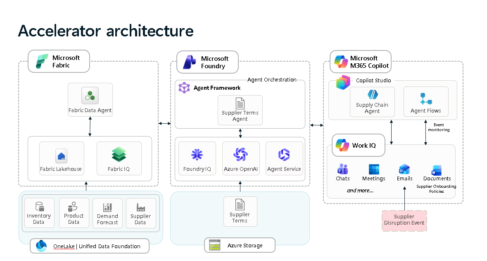

# Technical Architecture

## Solution Overview

The Microsoft IQ Solution Accelerator is a multi-agent AI system built on Microsoft Fabric, Azure AI Foundry, and Microsoft Copilot Studio. Three integrated components — **Work IQ**, **Fabric IQ**, and **Foundry IQ** — provide workflow orchestration, structured data intelligence, and knowledge retrieval respectively. A Copilot Studio Agent coordinates all three into a unified decision-support experience.



---

## Components

### Work IQ — Orchestration Layer

Work IQ is the entry point of the solution. A Power Automate cloud flow (**When a New Email Arrives (V3)**) captures incoming requests and invokes the **Copilot Studio Agent**. The agent determines user intent, calls the appropriate downstream agents, and synthesizes a unified response delivered via Microsoft Teams or email through **Microsoft Graph**.

### Fabric IQ — Structured Data Layer

Fabric IQ provides structured data intelligence through a Microsoft Fabric data lakehouse with six domain schemas: Customer, Product, Sales, Finance, Inventory, and Supply Chain. Lakehouse tables are surfaced through a **semantic model**, from which an **ontology** is derived. A **Fabric Data Agent** built on the ontology translates natural language queries into SQL at runtime. Two Power BI dashboards — Sales Overview and Supply Chain Management — are also deployed from the semantic model.

### Foundry IQ — Knowledge Layer

Foundry IQ provides document-based knowledge retrieval through Azure AI Foundry. PDF documents stored in Azure Blob Storage are page-chunked, vectorized using an OpenAI embedding model, and indexed in **Azure AI Search** with hybrid (keyword + semantic) retrieval. A **Knowledge Base** built on the search index uses automatic query planning to decompose complex questions. An **Azure AI Foundry Agent** (`ChatAgent`) connects to the Knowledge Base via [Model Context Protocol (MCP)](https://modelcontextprotocol.io/introduction), returning answers with page-level citations and direct document links.

---

## Request Flow

```
Incoming Email / Teams Message
          │
          ▼
 Power Automate Flow  ──  Parses request, invokes agent
          │
          ▼
 Copilot Studio Agent  ──  Understands intent, orchestrates sub-agents
     │                │
     ▼                ▼
 Fabric Data Agent    Foundry ChatAgent
 (Lakehouse /         (Azure AI Search /
  Ontology /           Blob Storage /
  Semantic Model)      MCP Knowledge Base)
     │                │
     └──────┬─────────┘
            ▼
 Synthesized response
            │
            ▼
 Microsoft Teams / Email  (via Microsoft Graph)
```

---

## Component References

| Component | Architecture & Deployment Details |
|---|---|
| Work IQ | [Copilot Studio Integration](./copilot/README.md) |
| Fabric IQ | [Fabric Architecture](./fabric/README.md) |
| Foundry IQ | [Foundry Architecture](./foundry/README.md) |
| Full Deployment | [Deployment Guide](./DeploymentGuide.md) |


